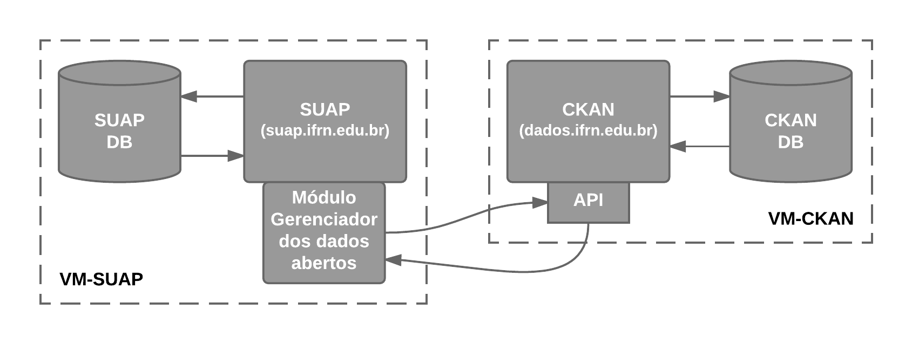

# OpenDataCollector

Aplicação responsável pela coleta dos dados, pela transformação desses dados e pelo cadastramento dos mesmos no CKAN. Na aplicação, a equipe de TI deverá cadastrar as Organizações, Grupos e Conjuntos de Dados, bem como as URLs dos serviços web disponibilizados pela API existente no SUAP e a periodicidade que os dados serão coletados, processados para o padrão de dados abertos e carregados no CKAN. 

### Arquitetura da Aplicação

